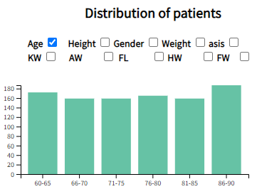

# GaitVis: A Visualization Tool for Gait Analysis
GaitVis is a visualization tool designed to explore gait characteristics among stroke survivor patients and healthy older adults. The project aims to aid clinicians and researchers in effectively differentiating gait characteristics between these two groups. Additionally, it seeks to explore correlations between gait characteristics and gait recovery, potentially uncovering previously unseen patterns in the data and helping to transform rehabilitation strategies for stroke survivor patients.

- __Access this project:__ https://komar41.github.io/GaitVis
- __GitHub repo:__ https://github.com/komar41/GaitVis
- __Demo Video:__ https://youtu.be/Ma3Z5PUPIko
- __Presentation:__ https://github.com/komar41/GaitVis/presentation.pptx
- __Tools used:__ - Python, NumPy, Pandas, JavaScript, HTML, CSS, SVG, D3.js

## Project Objectives

1. Explore correlations between gait features and stroke survivor patients' physical recovery time.
2. Estimate the risk of falling for stroke survivor patients.
3. Evaluate patients' current state and suggest appropriate training strategies.
4. Compare gait characteristics between stroke survivor patients and healthy older adults.

## Requirement Analysis

### Users
- Primary users: Gait researchers
- Secondary users: Clinicians of Physical Therapy
- Frequency: Users would access the system frequently

### Tasks
High-level tasks:
- Explore correlations between gait features and recovery time
- Estimate fall risk for stroke survivor patients
- Evaluate current patient state and suggest training strategies
- Compare gait characteristics between patient groups

Detailed tasks:
- Data access and filtering
- Computation of gait characteristics
- Statistical analysis
- Interactive visualizations
- Data export capabilities

### Non-functional Requirements
- Performance: Low latency visualizations and fast processing
- Privacy: Deidentified subject data
- Accessibility: Responsive UI for various screen sizes
- Usability: User-friendly interfaces for non-CS users
- Documentation: Step-by-step guide for new users

## Data and Tasks Abstraction

### Data Abstraction
1. Demographics data: Table with items (patients) and attributes (age, gender, height, etc.)
2. Ground Reaction Force Data: Time-series table with force attributes
3. Joint Angle Data: Time-series table with angle attributes

### Task Abstraction
- Analyze: Compare gait characteristics between groups and trials
- Search: Look up specific patient data or group data
- Filter: By property values, missing attributes, or extreme values
- Query: Identify patient information and statistics
- Compare: Ground reaction forces, joint angle data, and other gait features

## State-of-the-Art Report

- Existing tools like OpenSim, Tableau, and MATLAB have limitations in flexibility, interactivity, or specialization for gait analysis
- Previous research has focused on virtual environments, wearable technology, and specific patient groups
- Gaps identified in comparative analysis tools and comprehensive gait visualization systems

## Functional Specifications

### Scenarios
1. Statistical Representation of Patient Data
2. Search and analyze the gait trial of a group of patients
3. Compare two gait trials

### Goals and Targets
Low Targets:
- Display gait characteristics for a single trial
- Compute additional gait features
- Show data distribution of patients

Desirable Targets:
- Data filtering capabilities
- Comparison between trials or groups

High Targets:
- Create stick figure motion animation
- Estimate fall risk for patients

## Prototypes

Multiple iterations of prototypes were developed, focusing on different aspects:
- Statistical representation of patient data
- Group analysis capabilities
- Comparison of gait trials
- Novel GRF encoding
- Interactive features and linked views

## Final Composite Sketch

## Final Visualization Components

### 1. Novel Ground Reaction Force (GRF) Encoding
   - Displays GRFs for both feet
   - Updates based on selected trial and time slider
   - GRF values divided into three groups: low, mid, and high
   - Color-coded legend for anterior-posterior (AP), mediolateral (ML), and vertical (VT) forces
   - Time slider controls the displayed timestep

### 2. Line Charts for GRF and Joint Angle Values
   - Four line charts updated upon trial selection
   - Legends indicate types of forces/angles
   - Hover tooltips show exact force/angle values at each timestep
   - Black and yellow dashed lines indicate toe-off and touch-down timesteps

### 3. Histogram for Patient Feature Distribution
   - Located in the top-left section
   - Displays distribution of general features (e.g., age, height, gender, ankle width)
   - Represents data for the entire patient dataset

### 4. Spider Chart for Gait Feature Comparison
   - Positioned in the top-middle section
   - Compares gait features for up to three trials
   - Hover effect highlights the selected trial's spread

### 5. Parallel Coordinate Plot for Group Comparison
   - Located in the top-right section
   - Compares gait features between two different groups of patients
   - Hover effect highlights the group a selected trial belongs to

## Key Features:
- Interactive elements throughout all visualizations
- Linked updates between visualizations upon trial selection
- Ability to compare multiple trials and patient groups
- Time-based analysis for GRF and joint angle data

## Current Limitations:
- Histogram, spider chart, and parallel coordinate plot use mock data (pending real data integration)
- Limited to comparing up to three trials in the spider chart

## Future Enhancements:
- Integration of real patient data for all charts
- Implementation of brushing and linking between charts
- Addition of search and query options based on patient features
- Optimization of chart layout and positioning
- Option to switch between multi-patient and single-patient views

## Features

- Interactive visualizations with hover effects and tooltips
- Dropdown menu for trial selection
- Ability to compare multiple trials and groups
- Time-based analysis of ground reaction forces

## Technical Details

- Technologies: HTML, CSS, JavaScript, D3.js, Python, Pandas
- Version Control: Git
- Hosted on GitHub Pages

## Future Work

- Integrate real patient data for histogram, spider chart, and parallel coordinate plot
- Implement brushing and linking between charts
- Add option to choose between multi-patient and single-patient views
- Optimize layout and positioning of plots
- Incorporate search and query options based on sociodemographic and gait features

## Expert's Feedback

Expressed satisfaction with the project's progress and its potential as a visualization tool for gait analytics. Key points:
- Impressed with various tasks the interface can perform
- Appreciated the novel encoding for comparing force intensities
- Suggested implementing brushing and linking between charts
- Recommended adding options for multi-patient and single-patient views
- Suggested refining the overall positioning of plots
- Expressed satisfaction with the team's effort

Overall, the experts believed the project is on track to become a great visualization tool for gait analytics tasks.

## Team

- Kazi Shahrukh Omar
- Soham Pradhan
- Sajal Kherde
- Shuaijie Wang
- Tanvi Bhatt
- Fabio Miranda